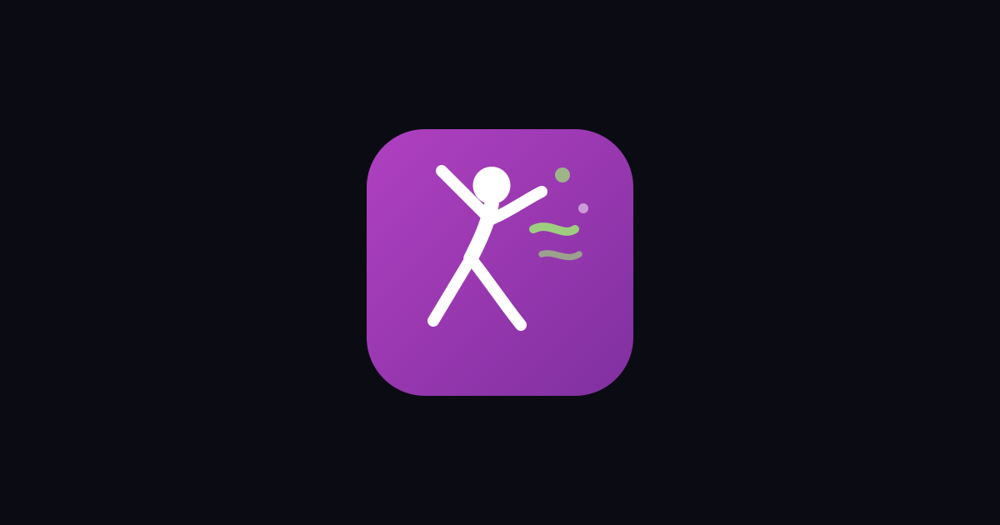

# AI Dance MCP Server

> AI Dance Generator - Make Any Photo Dance Online

[](./LICENSE)
[](#tools)
[](https://modelcontextprotocol.io/specification)
[](https://modelcontextprotocol.io)

<p align="center"><a href="https://aidance.live"></a></p>

A Model Context Protocol server that exposes the canonical AI Dance knowledge surface — image generation workflows and styles, pricing, FAQ, official links — to MCP-compatible AI clients such as Claude Desktop, Cursor, Windsurf, and Continue. Read-only, no API keys, no quota, ~50 ms cold start.

Official website: https://aidance.live

## 🎨 About AI Dance

AI Dance Live ([aidance.live](https://aidance.live)) is a web-based tool that turns static portrait photos into animated dance videos using AI motion transfer. Users upload a photo of a person, pet, or illustrated character, choose a dance style from a built-in choreography library or provide their own reference clip, and the platform generates a finished video — typically within minutes. The underlying models handle skeletal mapping, motion choreography extraction, and audio synchronization, producing output that keeps the subject's face and appearance consistent throughout the animation. Videos are exported in MP4 format at 720p or 1080p resolution, in clips up to 30 seconds long.

## Key Features

- **Motion library with multiple dance styles** — pre-loaded choreographies including hip-hop, K-pop, salsa, ballet, folk dances, and trending short-form routines, selectable without any technical setup.
- **Custom reference video upload** — users can supply their own dance clip as the motion source, giving full control over the choreography.
- **Face preservation** — the generation pipeline maintains the subject's facial identity and appearance frame-by-frame rather than drifting over time.
- **Audio synchronization** — generated dance animation is matched to the original audio track of the chosen choreography or uploaded reference.
- **Video extension and upscaling** — additional post-generation tools allow lengthening the clip or increasing output resolution beyond the default.
- **Powered by Kling Motion Control and Wan Animate models** — the platform uses established video generation models focused on motion precision rather than general-purpose image animation.

## Use Cases

- **Short-form social content** — creating TikTok videos, Instagram Reels, or YouTube Shorts where a still photo is animated to match a trending dance or audio clip.
- **Brand and mascot animation** — turning a company mascot, illustrated character, or product spokesperson photo into a dancing promotional clip without a production team.
- **E-commerce and product marketing** — animating product models or lifestyle photos to make catalog content more dynamic for ads and landing pages.
- **Personal and family entertainment** — making novelty videos from photos of babies, pets, or family members dancing to a favorite song.
- **Content creators without dance skills** — producing dance-format content for channels or accounts where the creator cannot or prefers not to appear on camera performing.

## Who Is It For

AI Dance Live is aimed at social media creators, digital marketers, and small business owners who want to produce animated video content without filming, choreographing, or editing expertise. The tool requires no prior video production knowledge — the workflow is upload, select, generate, download. It suits individuals who need a fast turnaround on short-form video for platforms like TikTok and Instagram, as well as brand teams looking for a lightweight way to animate existing photo assets for campaigns. Anyone who regularly works with portrait images and wants to add motion to them for entertainment or marketing purposes will find the site's focused toolset practical.

## Tools

### `list_styles`
Return the canonical list of image-generation styles or presets the site exposes. (AI Dance)

_Input:_ no parameters. _Returns:_ text/markdown.

### `get_pricing`
Return the canonical pricing entry point for AI Dance.

_Input:_ no parameters. _Returns:_ text/markdown.

### `get_official_links`
Return the canonical list of official links for AI Dance (website, support, docs when available).

_Input:_ no parameters. _Returns:_ text/markdown.

## Resources

- `site://aidance/styles` — Supported image-generation styles and presets.
- `site://aidance/pricing` — Canonical pricing entry point.
- `site://aidance/faq` — Short FAQ generated from public site metadata.
- `site://aidance/links` — Canonical URLs to share with users.

## Installation

Clone the repository and point your MCP client at the local entry point.

```bash
git clone https://github.com/<your-account>/aidance-mcp.git
cd aidance-mcp
pnpm install
```

### Claude Desktop

Add to `claude_desktop_config.json` (Settings → Developer → Edit Config):

```json
{
  "mcpServers": {
    "aidance-mcp": {
      "command": "node",
      "args": [
        "/absolute/path/to/aidance-mcp/src/index.mjs"
      ]
    }
  }
}
```

### Cursor / Windsurf / Continue

Use the same `mcpServers` block in your client's MCP configuration file.

### Debug with MCP Inspector

```bash
npx @modelcontextprotocol/inspector node src/index.mjs
```

## Official Links

- Website: https://aidance.live
- Pricing: https://aidance.live/pricing
- Community: https://discord.gg/HQNnrzjZQS
- Support: support@aidance.live

## Development

```bash
pnpm install
pnpm start                 # run the server over stdio
pnpm test                  # run the package tests
```

## License

MIT
